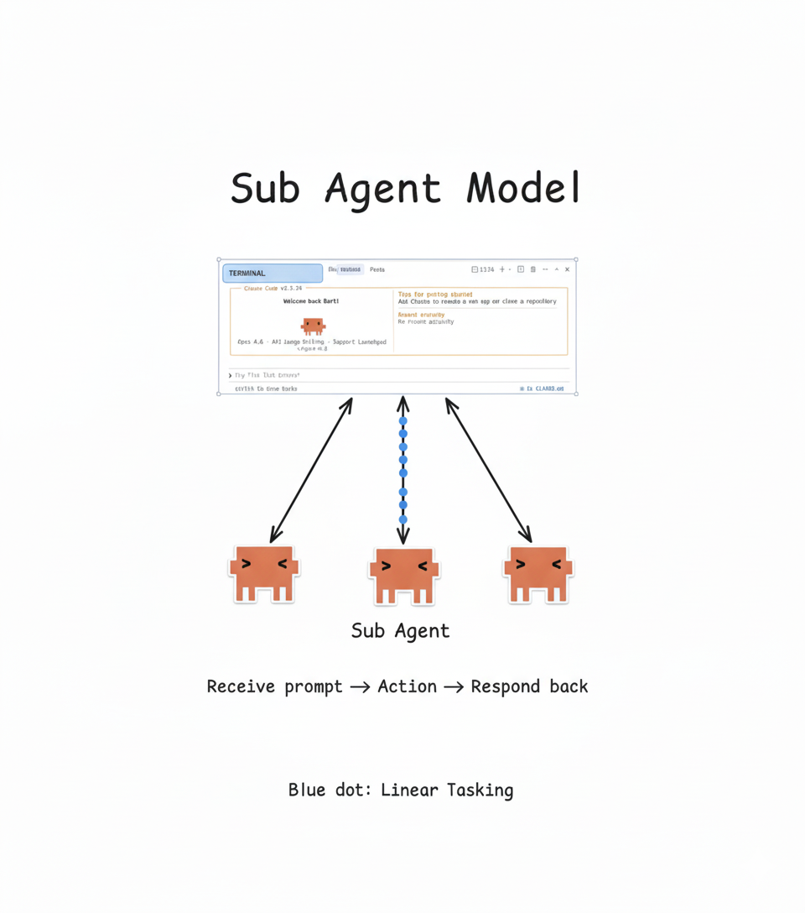
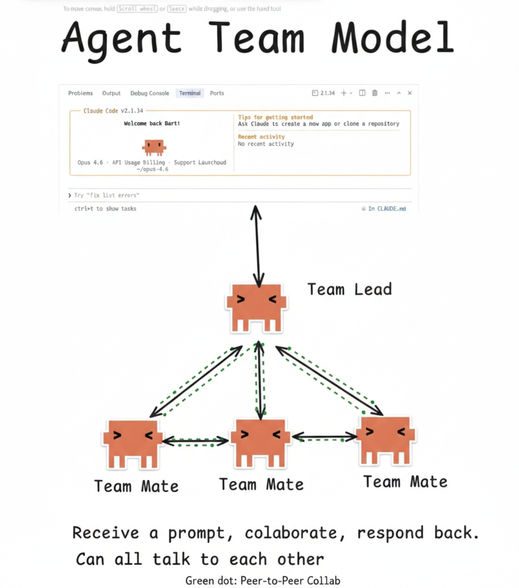

# Claude Code Agent Teams — Under the Hood

> How Claude Code orchestrates multi-agent collaboration, reverse-engineered by intercepting every tool call.

## What is this?

I placed a proxy between the Claude Code CLI and the Anthropic API, intercepting every tool call made during a multi-agent session. This repo documents what I found: the complete tool schemas, architecture diagrams, and a breakdown of how Claude Code's **Sub Agent** and **Team Agent** models actually work under the hood.

**What's inside:**
- The raw tool schemas (8 tools) captured from the API traffic
- Two architecture diagrams showing the Sub Agent and Team Agent models
- Deep-dive documentation on how the orchestration works
- A practical guide for prompting Claude Code to use teams effectively

## Sub Agent vs Team Agent

Claude Code has two fundamentally different approaches to multi-agent work. The same `Agent` tool spawns both — the difference is entirely in the parameters.

<table>
<tr>
<td align="center"><strong>Sub Agent Model</strong></td>
<td align="center"><strong>Team Agent Model</strong></td>
</tr>
<tr>
<td></td>
<td></td>
</tr>
<tr>
<td>Isolated, linear, parent-child only. The parent spawns a sub agent, waits for the result, and continues. No shared state.</td>
<td>Peer-to-peer, collaborative, shared task list. Teammates message each other, claim tasks, and self-organize around a shared board.</td>
</tr>
</table>

**The key difference?** Two parameters: `name` and `team_name`. Include them → teammate. Omit them → sub agent.

> Deep dive: [Sub Agent vs Team Agent](docs/sub-agent-vs-team-agent.md)

## Key Findings

### 8 Tools Power the Entire System

| Tool | Purpose |
|------|---------|
| [`TeamCreate`](docs/tool-reference.md#1-teamcreate) | Initialize a team — creates config + task directory on disk |
| [`TaskCreate`](docs/tool-reference.md#2-taskcreate) | Add a task to the shared list — the description becomes the agent's prompt |
| [`TaskList`](docs/tool-reference.md#3-tasklist) | Lightweight overview of all tasks (no descriptions, to save context) |
| [`TaskGet`](docs/tool-reference.md#4-taskget) | Full task details — what agents read before starting work |
| [`TaskUpdate`](docs/tool-reference.md#5-taskupdate) | Claim tasks, mark complete, set dependencies |
| [`TeamDelete`](docs/tool-reference.md#6-teamdelete) | Clean up — removes all team files from disk |
| [`SendMessage`](docs/tool-reference.md#7-sendmessage) | Inter-agent messaging — DMs, broadcasts, shutdown coordination |
| [`Agent`](docs/tool-reference.md#8-agent-spawner) | Spawn a sub agent or teammate — the universal entry point |

## Architecture Overview

The team lifecycle follows a clear sequence:

```
TeamCreate                    ← Initialize team on disk
    │
TaskCreate (×N)               ← Define work items
    │
Agent (×N)                    ← Spawn teammates (background)
    │
    ├── TaskList              ← Teammates scan for available work
    ├── TaskGet               ← Read full task details
    ├── TaskUpdate            ← Claim task (owner + in_progress)
    ├── [Do the work]
    ├── TaskUpdate            ← Mark task completed
    └── TaskList              ← Check for more work
    │
SendMessage                   ← Shutdown requests to all teammates
    │
TeamDelete                    ← Clean up everything
```

### Everything is Files on Disk

The entire coordination layer is file-based:

- **Team config:** `~/.claude/teams/{team-name}/config.json`
- **Tasks:** `~/.claude/tasks/{team-name}/{task-id}.json`
- **Inboxes:** File-based message delivery per agent

No database. No message queue. Just JSON files and a naming convention.

### The Typical Model Split

```
Team Lead (Opus)          ← Strong reasoning for decomposition & coordination
  ├── Teammate (Sonnet)   ← Fast, capable enough for focused implementation
  ├── Teammate (Sonnet)   ← Runs in background (run_in_background: true)
  └── Teammate (Sonnet)   ← Self-claims tasks from shared list
```

## Documentation

| Document | Description |
|----------|-------------|
| [Sub Agent vs Team Agent](docs/sub-agent-vs-team-agent.md) | Deep-dive comparison of both models |
| [Tool Reference](docs/tool-reference.md) | Complete documentation for all 8 tools |
| [Orchestration Guide](docs/orchestration-guide.md) | Practical tips for prompting effective teams |

## Raw Schemas

The intercepted tool schemas are available in [`schemas/tools.json`](schemas/tools.json). These are the actual JSON schemas sent between the CLI and the API.

## How to Use This

### Prompting Claude Code for Teams

Claude Code doesn't automatically use teams. Use explicit language:

```
"Use a team to implement this. Create tasks for each component
and spawn teammates to work in parallel."
```

```
"Set up a swarm — researcher + implementer + tester.
The researcher should analyze the codebase first, then
the implementer builds the feature, then the tester validates."
```

### Key Tips

1. **Say "team" or "parallel"** — This signals that you want multi-agent collaboration, not a single-agent workflow.
2. **Let the lead decompose** — Don't micro-manage task creation. Tell the lead what you want and let it break it down.
3. **Opus lead, Sonnet teammates** — The lead needs strong reasoning; teammates need speed.
4. **Background execution** — Always run teammates in the background so the lead can keep orchestrating.
5. **Task dependencies matter** — Use `blockedBy` to enforce ordering. Tasks without blockers run in parallel.

> Full guide: [Orchestration Guide](docs/orchestration-guide.md)

## How I Did This

1. Set up a local proxy (e.g., mitmproxy / custom HTTPS proxy) between the Claude Code CLI and `api.anthropic.com`
2. Ran Claude Code with a task that triggered team creation
3. Captured all API requests and responses
4. Extracted the tool schemas from the `tools` array in the API payload
5. Mapped the tool call sequence to understand the orchestration flow
6. Created the architecture diagrams from the observed patterns

## Contributing

Found something interesting in your own interceptions? Open an issue or PR.

## License

[MIT](LICENSE)
